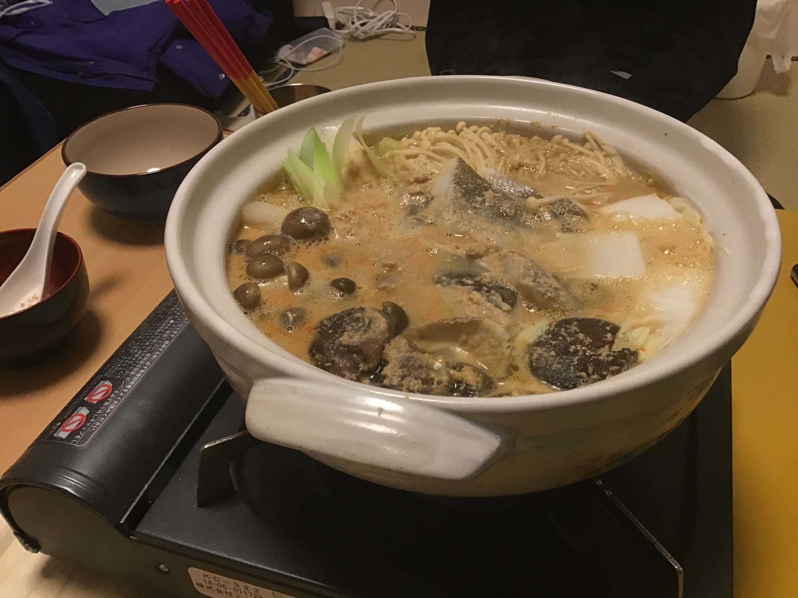

# あんこう鍋

## 材料

#### 出汁

- 水　1L
- 昆布　20g
- 乾燥しいたけ　20g
- かつおぶし　20g

#### 出汁の仕込み方

1. 昆布と乾燥しいたけを2時間水出しする
2. 昆布としいたけを取り出し、沸騰させる
3. 火を止め、鰹節を入れる。弱火で3分間煮出す。沸騰はさせない
4. 鰹節を取り出す

#### あんこうベース

- あんこう　700g
- 白味噌　100g
- 赤味噌　40g
- 酒　100cc
- みりん　50cc
- 薄口醤油  50cc
- 塩 大さじ1

#### 具材

- タラ
- 泥ネギ
- 白菜
- しいたけ
- えのき
- ぶなしめじ

#### シメ

- 讃岐うどん

#### レシピ

1. 出汁にあんこうベースを入れる
2. あんこうをしっかりと濾す
3. 鍋に具材を並べて、スープを入れる

#### 190304 感想

しのぴー
> あんこうがちょっと強い　塩味はベスト　第一ラウンドがよかった。結局あのままキープには出来ればいい。もう少しごろごろ野菜が入ってたらよりよい。

あだ
> さんじを意識。あんこうを攻めてみた。攻めすぎたけど、結果的にはよかった。かなり好みの味になったけど、後半にあんこうのスープの味が濃くなりすぎたので、追いスープがあればもっとよかった。

