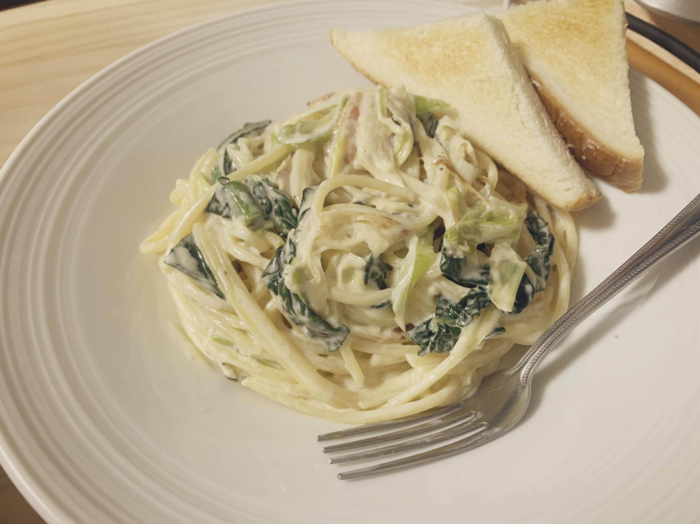

# みっこ野菜のクリームパスタ

### 材料(食欲旺盛な男性3人分)

#### お野菜

- 黄金カブ 2.5株
- カーボロネロ 2パック
- ネギ 2本

#### その他

- ベーコン 80g
- 生クリーム　400cc
- 牛乳　200cc
- パスタ 300g
- オリーブオイル 60cc
- グラナパダーノ 30g

#### パスタソース

1. オリーブオイル60ccをフライパンに入れ、短冊切りしたベーコンを油にしっかり馴染ませる（火はまだつけない）
2. ベーコンにしっかりと油が馴染んだところで強火で火を入れる
3. こんがりしてきたらベーコンを取り出す。
4. オイルに薄切りにした黄金株を入れて火を通す
5. 薄切りにしたネギを入れて火を通す
6. カーボロネロを投入して軽く火を通す
7. 全体的にしんなりしてきたら、牛乳と生クリームを投入
8. 2/3くらいになるまで煮詰める
9. 最後にパスタ、すりおろしたグラナパダーノ、ソースを一緒に和える

#### 反省点
1. ベーコン油に頼ってしまって、せっかくの野菜の風味が少し損なわれた。

#### 感想
- カーボロネロの苦味がとても良いアクセントになっていて美味しかった。
- ネギをごく薄切りにしたのがパスタとクリームにからんで美味しかった。
- 黄金カブはザク切りか薄切りか悩んでイチョウ切りにしたが、ザク切りで食感を残してもよかったかなと思った。薄切りは薄切りでそこまで存在感を主張しない感じで美味しかった。

#### みっこ先生からアドバイス

野菜に合うパスタ、、基本的には野菜は万能だからどんな味付けでもおすすめしたいけれど…せっかくなので合いそうな野菜の組み合わせを🙆  
- トマト系：カーボロネロ、なす、玉ねぎ、人参、ズッキーニ
- ナポリタン系：ピーマン、玉ねぎ、人参
- クリーム系：ほうれん草、キャベツ、空豆、かぶ、えんどう、かぼちゃ
- オイル系：小松菜、ズッキーニ、なす、長ねぎ、菜花、キャベツ、カーボロネロ、春菊、蓮根、空豆、かぶ、大根、枝豆、えんどう、かぼちゃ
- ジェノベーゼ系：春菊、バジル、ほうれん草、人参の葉

こうやってみるとオイル系は万能だけど、野菜のかさ(量)を増やすには煮込めるトマト系の方がいいかもです…！
